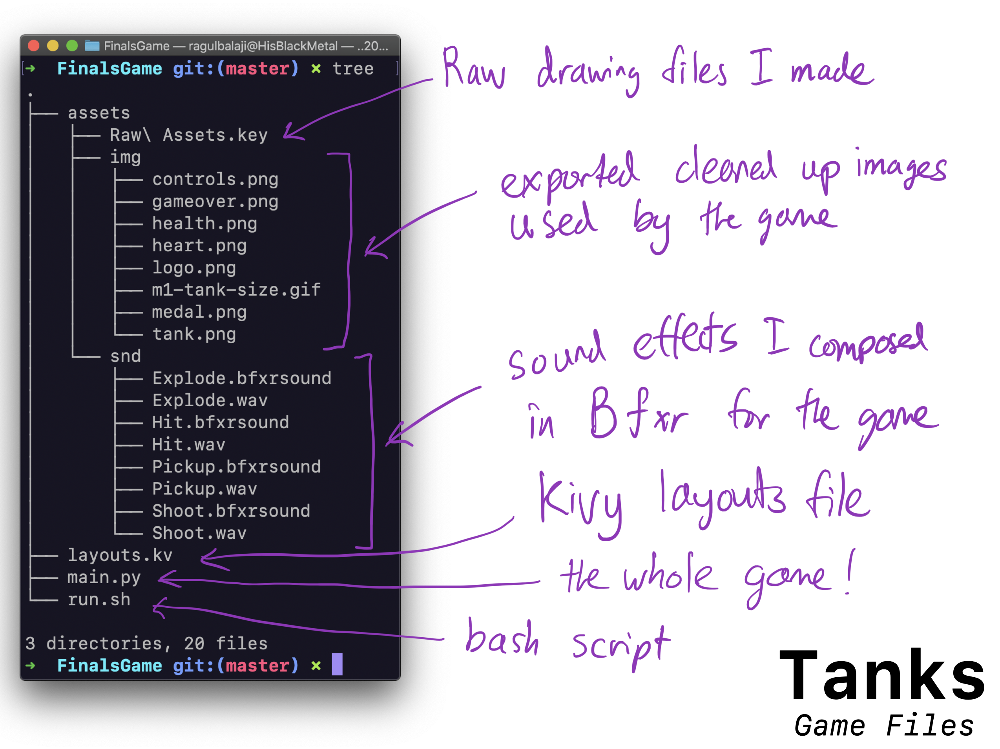
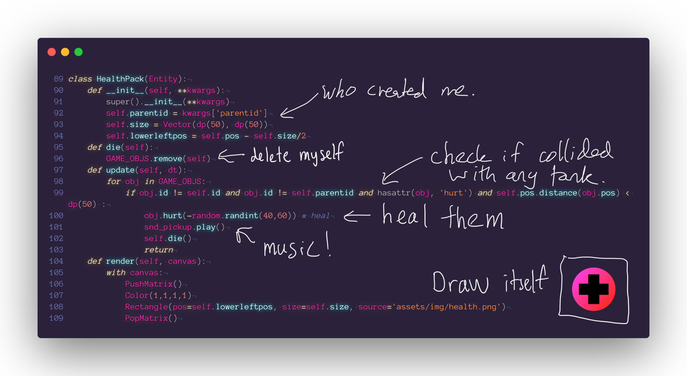
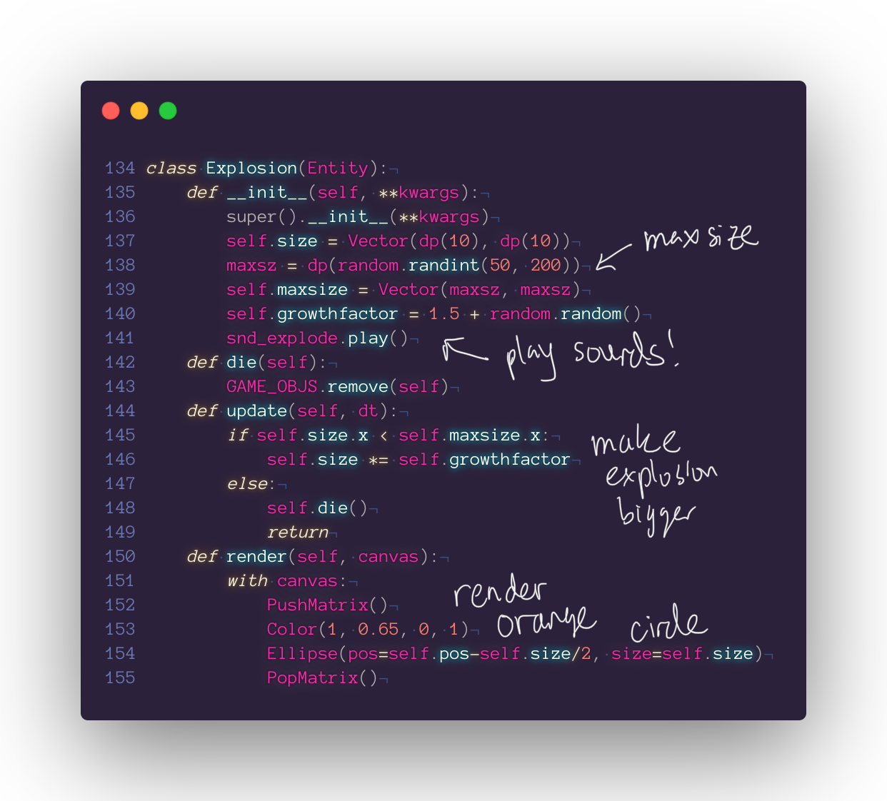

# Tanks - a game for the 10.009 Digital World course 
V S Ragul Balaji 2020 &copy; All Rights Reserved

## Player Objective
Aim and shoot bullets at the RED enemy tanks to damage them, scavenge parts and medical supplies (colourful plus logo aka. health packs) of dead enemy tanks to boost your own health. 

Defend the Motherland. How long can you last? 

Watch [Tanks Gameplay with Intro Trailer - Youtube](https://www.youtube.com/watch?v=GyXKp_XBjiM)

## Controls

## Game States

## Game Structure

## Annotated Code

#### Part 1: Importing stuff

#### Part 2: The Entity Class

#### Part 3: Health Pack, a type of Entity that heals you

#### Part 4: Score Floater, a type of Entity used for animations

#### Part 5: Explosion, a type of Entity used for animations

#### Part 6: Bullet, a type of Entity that you can shoot

#### Part 7: Enemy Tank, a type of Entity tank with basic AI that tries to kill you

#### Part 8: Player Tank, a type of Entity you can drive and shoot enemies with.

#### Part 9: Game Over Widget, helps draw the game over screen

#### Part 10: Game Canvas, the main widget that holds the game loop, handles user inputs and we draw the game to

#### Part 11: Setting up Kivy Things

Spring 2020! Please ask me before you reuse any of this code for any other use.